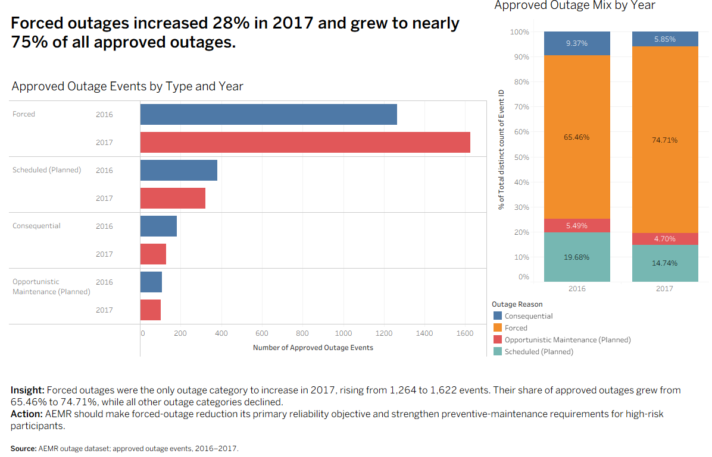
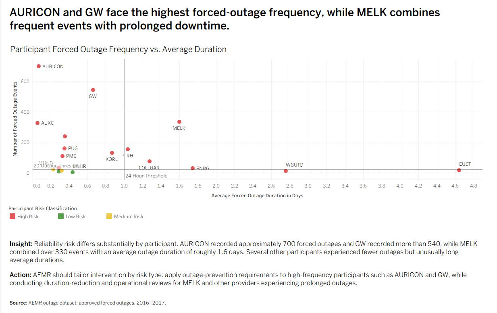
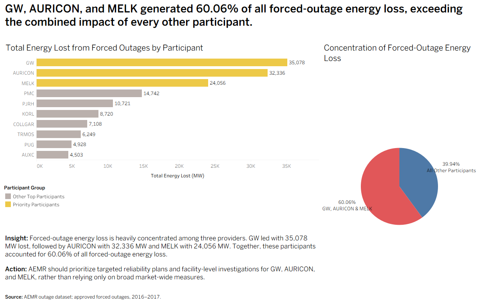

# AEMR Energy Reliability Analysis

## Project Overview

This project analyzes approved electricity-market outage events to identify reliability risks, participant-level patterns, energy-loss concentration, and recurring causes of forced outages.

SQL was used to explore and summarize the underlying outage data, while Tableau was used to build an interactive stakeholder-focused story highlighting the most consequential findings and recommended actions.

## Business Problem

Energy-market regulators need to understand where reliability risk is concentrated so that monitoring and intervention can be directed toward the participants, facilities, and outage causes creating the greatest operational impact.

The analysis focuses on approved outage events from 2016 and 2017, with particular attention to unplanned forced outages.

## Business Questions

This project explores several questions:

- How did outage activity change between 2016 and 2017?
- Which outage types contributed most to reliability risk?
- Which participants and facilities experienced the highest forced-outage activity?
- Where was forced energy loss most concentrated?
- Which recurring outage causes created the greatest impact?
- What actions could AEMR prioritize based on these patterns?

## Tools Used

- SQL
- Tableau
- Data cleaning and transformation
- Exploratory data analysis
- Calculated fields
- Dashboard development
- Data visualization
- Stakeholder-focused data storytelling

## Analysis

### Forced Outage Trends

Compared approved outage activity across 2016 and 2017 to determine which outage categories were driving changes in reliability risk.

### Participant Risk

Evaluated outage frequency and average duration to identify participants with recurring or prolonged forced-outage activity.

### Energy-Loss Concentration

Measured forced energy loss by participant to determine whether operational impact was broadly distributed or concentrated among a smaller number of market participants.

### Facility Severity

Compared outage duration, energy loss per event, and event frequency across priority facilities to distinguish high-frequency risk from high-severity risk.

### Recurring Causes

Analyzed forced-outage causes to identify operational issues responsible for disproportionate energy-loss impact.

### Performance Trends

Compared priority participants across years to identify improving and worsening patterns.

## Project Highlights

### Forced Outages Became the Primary Reliability Concern

Forced outages increased from 1,264 events in 2016 to 1,622 in 2017, an increase of approximately 28%. Their share of all approved outages rose from 65.46% to 74.71%, while every other outage category declined.

### Reliability Risk Varied by Participant

Participant-level analysis showed different forms of reliability risk. AURICON and GW experienced the highest forced-outage frequency, while MELK combined frequent events with a comparatively long average outage duration.

### Forced Energy Loss Was Highly Concentrated

GW, AURICON, and MELK together accounted for 60.06% of all forced-outage energy loss, exceeding the combined impact of every other participant.

### A Small Number of Causes Drove Disproportionate Impact

GW's recurring operational issues generated 28,688 MW of energy loss, nearly five times the impact of AURICON's full-unit trips, the next-largest identified forced-outage cause.

## Key Findings

- Forced outages increased from **1,264 events in 2016 to 1,622 in 2017**, an increase of approximately **28%**.
- Forced outages represented approximately **65% of approved outages in 2016** and nearly **75% in 2017**.
- **GW, AURICON, and MELK accounted for approximately 60% of forced energy loss**, indicating that reliability risk was highly concentrated.
- GW recorded approximately **35,078 MW** of forced energy loss, followed by AURICON at approximately **32,336 MW** and MELK at approximately **24,056 MW**.
- AURICON's forced energy loss increased from approximately **10,696 MW to 21,640 MW**, an increase of roughly **102%**.
- GW's recurring operational issues accounted for approximately **28,688 MW** of energy loss, substantially more than any other identified cause.
- MELK showed declining total energy loss year over year, but individual facility severity remained important to monitor.

## Recommended Actions

Based on the analysis:

- Prioritize reducing the frequency of forced outages through targeted monitoring and preventive controls.
- Focus intervention on the participants and facilities responsible for the greatest concentration of energy loss.
- Develop cause-specific corrective actions for recurring operational issues.
- Track participant performance against the 2016–2017 baseline to evaluate whether reliability improves over time.

## Tableau Story

[View the interactive AEMR Energy Reliability Analysis on Tableau Public](https://public.tableau.com/app/profile/marissa.sweet/viz/AEMREnergyReliabilityAnalysis/AEMREnergyReliabilityAnalysis?publish=yes)

The Tableau Story presents the analysis as a stakeholder-focused narrative, moving from the business problem through outage trends, participant and facility risk, energy-loss concentration, recurring causes, and recommended actions.

## Skills Demonstrated

- SQL querying and aggregation
- Exploratory data analysis
- Trend analysis
- Risk segmentation
- Tableau dashboard development
- Calculated fields
- Data visualization
- Business analysis
- Stakeholder communication
- Translating analytical findings into recommendations

## Project Files

Additional SQL files and selected Tableau visuals are included in this repository.

## About This Project

This project was completed as part of my Data Analytics Career Program coursework and was adapted for portfolio presentation to highlight my SQL, Tableau, analytical reasoning, and stakeholder communication skills.
